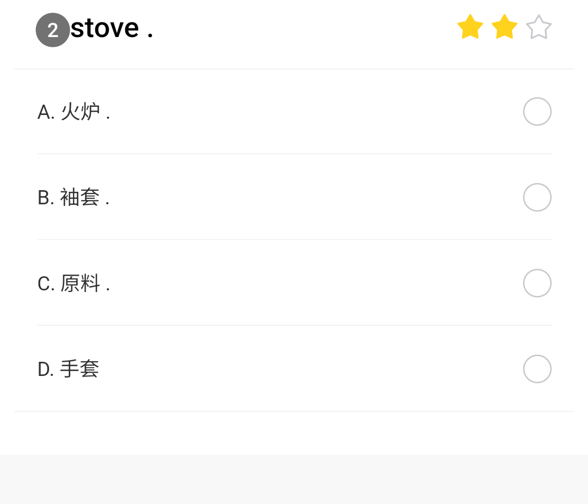

# iLoveWord

大概是一个HDU的我爱记单词的自动答题脚本

最初写于2023年11月大概，是托大的（因为是*自用*的），准备最近重写一下（如果有兴趣的话

> ↑ 如果上面那句话还没改的话说明还没重写呢（逃

> 因为通过adb操作设备所以仅支持安卓呢亲w
>
> 没有在Linux上测试过 ~~，我觉得是跑不通的~~
>

## 免责声明 / Disclaimer

此程序仅供学习、交流和研究使用。作者编写该脚本的目的是为了提供编程和自动化任务的学习示例，并不鼓励或支持在任何实际情况下使用该脚本来违反任何规定或规章制度。使用者应自行判断和承担使用本脚本的后果。

作者对此脚本的使用结果不承担任何责任。因使用本脚本而造成的任何直接或间接后果均由使用者自行承担。

This program is for educational, communication, and research purposes only. The author created this script as a learning example for programming and automation tasks and does not encourage or support its use in any real-world situations that would violate any rules or regulations. Users should exercise their own judgment and assume responsibility for the consequences of using this script.

The author is not liable for any outcomes resulting from the use of this script. Any direct or indirect consequences caused by the use of this script are the sole responsibility of the user.

## 大致原理

1. 通过adb抓取设备屏幕画面，裁剪出有效区域
2. OCR提取文本
3. 将英语单词内容交给词典，将返回的查询结果与中文内容作比较，选择相似度最高的选项
   > 如果题干是中文就查询每个选项，反之则查询题干。因为中文不方便查词典（）
4. 使用adb模拟点击此选项的屏幕位置
5. 等待我爱记单词自动跳到下一题
6. 回到步骤1，除非已循环100遍

~~很简单的你也可以自己写~~

## 使用方法

### 配置

1. 从 [ECDICT](https://github.com/skywind3000/ECDICT) 仓库的 Release 中下载**数据库形式**（sqlite）的词典，解压后放置于脚本文件夹的目录中并将其命名为 `stardict.db`
2. 打开安卓设备的开发者选项中的USB调试，在电脑上安装 [platform-tools](https://developer.android.com/tools/releases/platform-tools?hl=zh-cn) 并添加到 PATH 环境变量，将安卓设备与电脑连接，在安卓设备上允许电脑对其进行调试
   > 看情况可能需要进一步在开发者选项中允许USB调试模拟点击
3. 设置虚拟环境，安装 `requirements.txt` 中的第三方库
4. 根据实际情况调整 `main.py` 中的裁剪区域（`available_region` 变量的内容），确保裁剪后的图像只包含了题目内容
   > 裁剪后的图像应该像这样，除了题干与选项外不包含其他文本内容：
   >
   > 

`available_region` 变量是一个四元组，内容为裁剪区域的矩形像素坐标表示 `(left, top, right, bottom)`，一般将`left`设为`0`，将`right`设为屏幕宽度，然后调整`top`和`bottom`就好。坐标从图片右上角起算，向下y坐标递增，向右x坐标递增，参见 [pillow 文档](https://pillow.readthedocs.io/en/stable/reference/Image.html#PIL.Image.Image.crop)

### 使用

1. 连接设备，在虚拟环境中运行 `main.py`
2. 在安卓设备中打开我爱记单词
   > 如果是首次运行，先点击自测，确保一切无误后再考试（首次运行时Paddle可能会下载一些必需内容）
3. 当程序提示 `Press ENTER to start` 时，操作安卓设备进入答题页面，然后在终端中按下 Enter 键
4. 等待程序运行，如果运行结束后仍有未完成的题可以再次运行
   > 如果需要提前结束，按 `Ctrl+C` 终止程序即可
5. 作答完成，**手动提交**，超时未交会被判没分

## 注意事项

经测试 PaddleOCR 似乎无法在过高版本的 Python 中运行，程序在 3.10.* 中通过测试，推荐使用w

如果使用了一些难以辨认的字体，正确率可能大幅下降

如果裁剪后的识别区域有肉眼可见的无关文本，正确率必然大幅下降

## 效果

配置无误的话平均3分钟左右完成，80分以上

## 杂项

TODO:

- 使程序更加简单易用
